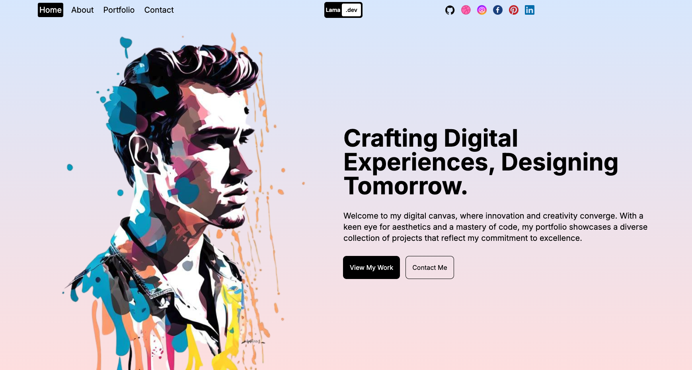
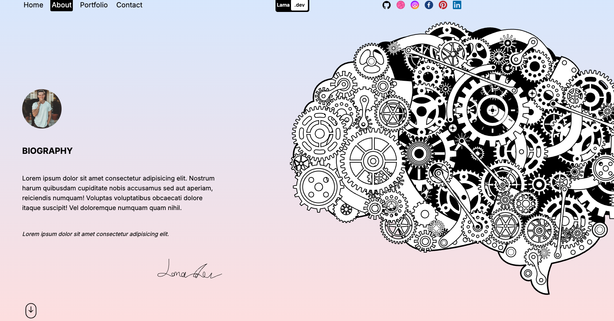

# 💻 Digital Portfolio - Next.js Developer Website

A modern, animated developer portfolio built with **Next.js**, **Tailwind CSS**, and **Framer Motion**.  
Crafted to showcase front-end projects with smooth transitions and responsive design.

## 🖼️ Screenshots



. will be updated soon !!!!!

> 📸 Screenshots are located in the `/public/screenshots` folder. You can replace them with your own.

## 🌟 Features

- 🎨 Stylish and responsive layout
- 🧠 Animated biography and skill sections
- ⚡ Smooth page transitions with Framer Motion
- 🧩 Modular components and clean codebase
- 🌐 SEO-optimized head tags and accessible structure

## 🛠 Tech Stack

- [Next.js](https://nextjs.org/)
- [Tailwind CSS](https://tailwindcss.com/)
- [Framer Motion](https://www.framer.com/motion/)
- [React Icons](https://react-icons.github.io/react-icons/)
- [TypeScript (optional)]

## 🚀 Getting Started

Clone the repository:

```bash
git clone https://github.com/yourusername/your-portfolio.git
cd your-portfolio